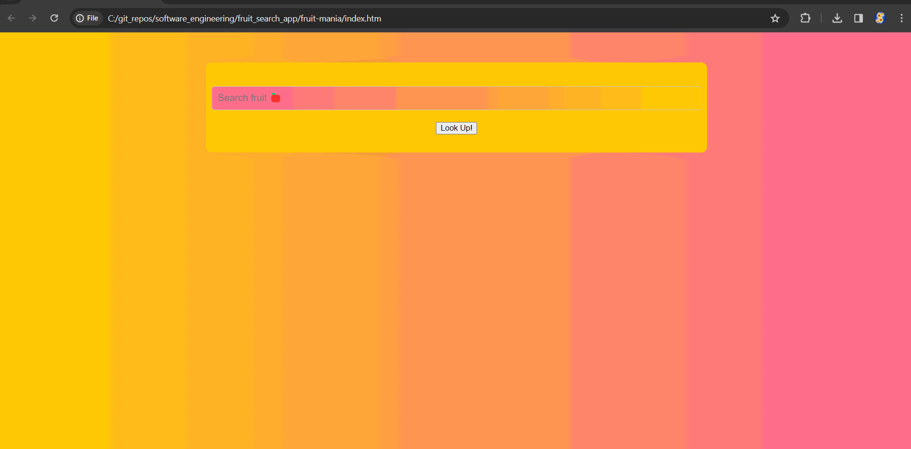

# fruit-mania

## What it is:
A predictive fruit search web app

## What it does:
User types in a fruit name. The app will predict the fruit names based on the user's input

## Tools used:
HTML, CSS, and JavaScript (ES2015)

## Development plan:
This implementation uses vanilla JavaScript. That being said, seperate backend, frontend, and more efficient search algorithm will be implemented in the coming days

## Running the app:
Just open "index.htm" in google chrome

## Demo:

